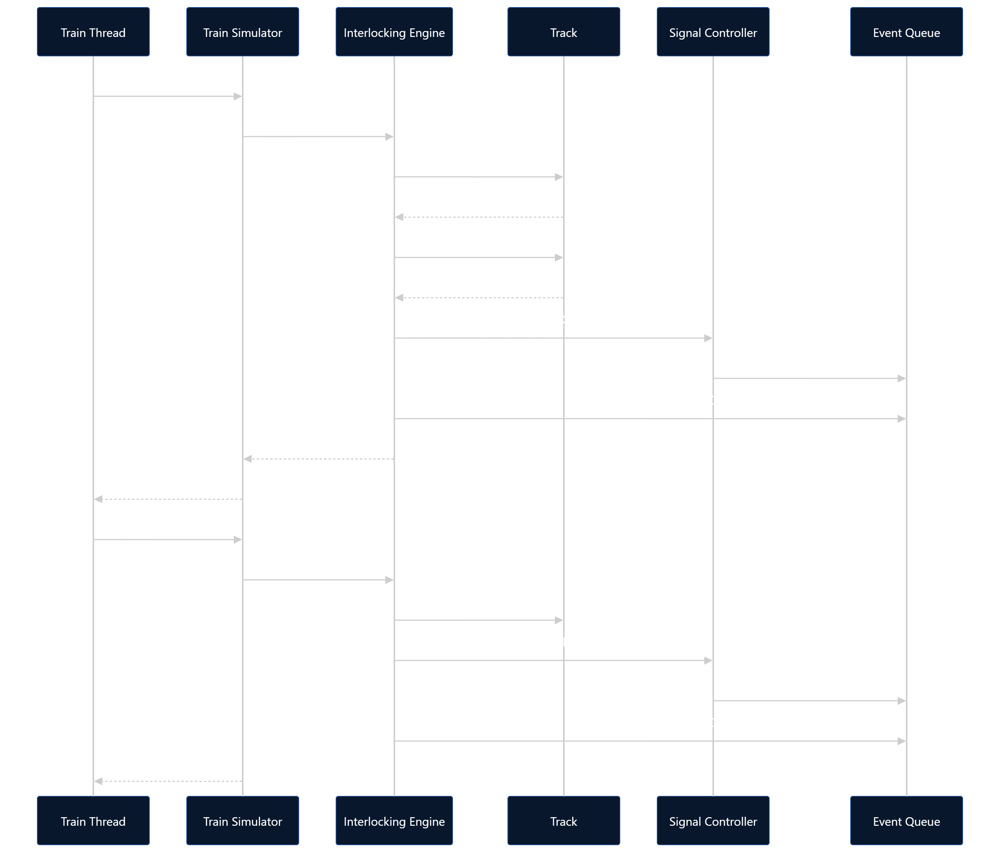

🚂 Automated Railway Interlocking & Collision Avoidance Engine

A Python-based railway simulation system that demonstrates how railway interlocking, route reservation, mutual exclusion, multithreading, event-driven processing, signal control, and collision monitoring** can be used to coordinate concurrent train movements.

> **Note:** This project is an educational software simulation and is not intended for deployment in real railway safety-critical systems.

---

## 📌 Project Overview

Modern railway networks involve multiple trains sharing tracks, junctions, and routes. When several trains request overlapping resources at the same time, the system must coordinate access to prevent conflicting movements and unsafe resource usage.

This project models a railway network in software and simulates multiple trains operating concurrently.

The system uses an **interlocking engine** to check route availability, reserve required tracks, control signals, coordinate concurrent train requests, and release resources after train movement.

A **collision monitoring layer** provides an additional defensive check for possible track conflicts.

The project also provides both **Streamlit** and **Flask-based dashboards** for observing the simulation visually.

---

# 🎯 Problem Statement

In a railway network, multiple trains may simultaneously request routes that share common tracks or junctions.

Without proper coordination, concurrent requests can result in:

- Route conflicts
- Track contention
- Multiple trains attempting to access the same resource
- Unsafe train movements
- Potential collision conditions
- Resource waiting
- Deadlock-related situations

The challenge is to design a software system that can coordinate these concurrent operations while maintaining consistent resource states.

---

# 💡 Proposed Solution

The project implements a software-based railway interlocking and simulation engine.

The system:

1. Models stations, tracks, signals, trains, routes, and events.
2. Creates predefined railway routes.
3. Runs trains concurrently using Python threads.
4. Checks whether all required tracks are available.
5. Reserves tracks before granting a route.
6. Uses mutual exclusion locks to protect shared resources.
7. Changes signal states when routes are granted or released.
8. Moves trains through their assigned routes.
9. Releases tracks after movement.
10. Processes simulation events through a thread-safe event queue.
11. Monitors possible track conflicts.
12. Provides dashboards for real-time visualization and monitoring.

---

# 🏗️ System Architecture


                         Railway Simulation Engine
                                  │
                    ┌─────────────┴─────────────┐
                    │                           │
              Core Engine                  User Interfaces
                    │                           │
        ┌───────────┼───────────┐         ┌─────┴─────┐
        │           │           │         │           │
   Interlocking   Train       Event   Streamlit     Flask
     Engine     Simulator     Queue   Dashboard    Web UI
        │
        ├── Route Reservation
        ├── Resource Management
        ├── Mutual Exclusion
        ├── Signal Control
        └── Collision Monitoring

The core railway logic is separated from the visualization layer.

This allows the same simulation concepts and engine components to be used by different user interfaces.

# 📐 UML & Design Diagrams

The following diagrams describe the design and behavior of the railway simulation system.

---

## 1. UML Class Diagram

The class structure represents the main railway entities and engine components.

```mermaid
classDiagram

    class Station {
        +str station_id
        +str name
    }

    class Track {
        +str track_id
        +str source
        +str destination
        +str occupied_by
        +str reserved_by
        +Lock lock
        +is_available()
        +reserve(train_id)
        +release(train_id)
        +occupy(train_id)
        +leave(train_id)
    }

    class Signal {
        +str signal_id
        +SignalState state
        +set_state(state)
        +is_clear()
    }

    class Train {
        +str train_id
        +str source
        +str destination
        +float speed
        +TrainState state
        +str current_track
        +list route
        +set_state(state)
        +assign_route(route)
    }

    class Route {
        +str route_id
        +str source
        +str destination
        +list track_ids
        +contains_track(track_id)
        +conflicts_with(other)
    }

    class Event {
        +EventType event_type
        +str train_id
        +str resource_id
        +str message
        +datetime timestamp
    }

    class RailwayNetwork {
        +dict stations
        +dict tracks
        +dict signals
        +add_station()
        +add_track()
        +add_signal()
        +get_station()
        +get_track()
        +get_signal()
    }

    class EventQueue {
        +Queue queue
        +list history
        +publish(event)
        +get()
        +task_done()
        +join()
        +get_history()
    }

    class InterlockingEngine {
        +RailwayNetwork network
        +EventQueue event_queue
        +Lock lock
        +dict active_routes
        +request_route()
        +release_route()
    }

    class TrainSimulator {
        +start_train()
        +run_train()
        +wait_for_train()
    }

    class CollisionMonitor {
        +check_track_conflict()
        +emergency_stop()
    }

    class SignalController {
        +set_green()
        +set_red()
    }

    RailwayNetwork "1" o-- "*" Station
    RailwayNetwork "1" o-- "*" Track
    RailwayNetwork "1" o-- "*" Signal

    Train --> Route : assigned
    Route --> Track : contains

    InterlockingEngine --> RailwayNetwork : manages
    InterlockingEngine --> EventQueue : publishes
    InterlockingEngine --> SignalController : controls

    TrainSimulator --> Train : runs
    TrainSimulator --> InterlockingEngine : requests routes

    CollisionMonitor --> Train : monitors
    CollisionMonitor --> EventQueue : publishes

    SignalController --> Signal : controls
    SignalController --> EventQueue : publishes

    EventQueue --> Event : stores

## 2. UML Sequence diagram

The following sequence shows how a train requests and obtains a route.



# 🚉 Railway Network

The simulation models:

6 stations
10 tracks
10 signals
10 predefined routes
Multiple concurrent trains

The railway network contains shared tracks and junctions so that concurrent route requests and resource contention can be demonstrated.

Network Structure
                    ┌──────── Station B
                    │
Station A ─── J1 ───┤
                    │
                    └──────── Station C

Station D ─── J1 ─── J2 ──── Station E
                       │
                       └──── Station F

The actual simulation network is represented using Python objects for stations, tracks, signals, and routes.

🚦 Railway Interlocking

Railway interlocking is the central concept of this project.

The interlocking engine decides whether a train can obtain a requested route based on the availability of the required tracks.

For example:

Train T1
   │
   ▼
Request Route R1
   │
   ▼
Check TR1
   │
   ▼
Check TR2
   │
   ├── Track unavailable → Reject / Wait
   │
   ▼
Reserve required tracks
   │
   ▼
Grant route
   │
   ▼
Change signal
   │
   ▼
Train movement

A route is granted only when the required resources can be reserved successfully.

# 🔐 Mutual Exclusion and Locks

Railway tracks are shared resources.

Since multiple train threads may attempt to access the same track concurrently, synchronization is required.

The project uses Python's threading.Lock to protect track state changes.

Example:

with self.lock:
    if not self.is_available():
        return False

    self.reserved_by = train_id
    return True

This demonstrates the operating-system concept of mutual exclusion, where only one thread can modify a protected resource at a time.

# 🛤️ Route Reservation

Each route contains a sequence of track IDs.

Example:

Route R1

Station A → Station B

TR1 → TR2

Before a route is granted, the interlocking engine checks all required tracks.

If all tracks are available:

Tracks Available
       ↓
Reserve Tracks
       ↓
Route Granted
       ↓
Signal → GREEN
       ↓
Train Moves

If a required track is unavailable:

Track Unavailable
       ↓
Route Rejected
       ↓
Train Waits / Retries

This prevents two trains from being granted conflicting resources at the same time.

# 🧵 Multithreading

Each train can operate in its own thread.

For example:

Train T1 → Train Thread 1
Train T2 → Train Thread 2
Train T3 → Train Thread 3
Train T4 → Train Thread 4

This allows multiple train requests and movements to occur concurrently.

The project therefore demonstrates practical concepts related to:

Threads
Shared resources
Synchronization
Mutual exclusion
Concurrent resource requests
# 📬 Thread-Safe Event Queue

The project uses Python's queue.Queue to process events generated by different components.

The event queue provides a thread-safe mechanism for communicating simulation events.

Examples include:

TRAIN_CREATED
TRAIN_STARTED
ROUTE_REQUESTED
ROUTE_GRANTED
ROUTE_REJECTED
TRACK_RESERVED
TRAIN_MOVED
TRACK_RELEASED
SIGNAL_CHANGED
COLLISION_WARNING
EMERGENCY_STOP
TRAIN_ARRIVED

The event processor consumes these events and records the simulation activity.

# 🚦 Signal Control

Signals are represented as objects with states such as:

RED
GREEN
YELLOW

During route processing:

Route Granted
     ↓
Signal → GREEN

After the route is released:

Route Released
     ↓
Signal → RED

Signal changes are also published as simulation events.

# 🚆 Train State Machine

Each train progresses through different states during the simulation.

CREATED
   │
   ▼
WAITING
   │
   ▼
ROUTE_REQUESTED
   │
   ▼
ROUTE_GRANTED
   │
   ▼
MOVING
   │
   ▼
ARRIVED

If a required resource is unavailable:

WAITING_FOR_TRACK
        │
        ▼
   Retry Request
        │
        ▼
  ROUTE_GRANTED

Collision-related states include:

COLLISION_WARNING
        │
        ▼
EMERGENCY_STOP

The state machine makes the train's current condition visible to the monitoring dashboards.

# 🛡️ Collision Monitoring

The project contains a dedicated collision monitoring component.

The monitor checks whether two trains are attempting to occupy the same track.

If a possible conflict is detected:

Possible Track Conflict
          ↓
COLLISION_WARNING
          ↓
EMERGENCY_STOP

The collision monitor acts as an additional defensive layer in the simulation.

Under normal operation, the interlocking engine should prevent conflicting route reservations before trains enter the same protected resource.

# 🔄 Simulation Flow

The overall simulation follows this process:

1. Create Railway Network
            ↓
2. Create Stations, Tracks & Signals
            ↓
3. Define Routes
            ↓
4. Create Train Objects
            ↓
5. Start Train Threads
            ↓
6. Request Routes
            ↓
7. Check Track Availability
            ↓
8. Reserve Required Tracks
            ↓
9. Grant Route
            ↓
10. Change Signal
            ↓
11. Move Train
            ↓
12. Release Tracks
            ↓
13. Restore Signal
            ↓
14. Train Arrives
🧩 Object-Oriented Design

The railway system is modeled using Python classes.

Main Model Classes
Class	Responsibility
Station	Represents a railway station
Track	Represents a railway track and its resource state
Signal	Represents a railway signal
Train	Represents a train and its current state
Route	Represents a train route and required tracks
Event	Represents a simulation event
RailwayNetwork	Stores stations, tracks, and signals
Main Engine Components
Component	Responsibility
InterlockingEngine	Route checking and resource reservation
TrainSimulator	Concurrent train movement
EventQueue	Thread-safe event management
EventProcessor	Processes generated events
CollisionMonitor	Detects possible track conflicts
SignalController	Controls signal states
SystemMonitor	Displays system status
 # 📁 Project Structure
railway_interlocking_engine/
│
├── main.py
├── requirements.txt
├── README.md
│
├── models/
│   ├── __init__.py
│   ├── station.py
│   ├── track.py
│   ├── signal.py
│   ├── train.py
│   ├── network.py
│   ├── route.py
│   └── event.py
│
├── engine/
│   ├── event_queue.py
│   ├── event_processor.py
│   ├── interlocking.py
│   ├── train_simulator.py
│   ├── collision_monitor.py
│   ├── signal_controller.py
│   └── system_monitor.py
│
├── ui/
│   └── dashboard.py
│
├── web/
│   ├── app.py
│   ├── templates/
│   │   └── index.html
│   └── static/
│       ├── style.css
│       └── script.js
│
├── tests/
│
├── logs/
│
└── docs/
    └── project-documentation.pdf
🖥️ Streamlit Dashboard

The project includes a Streamlit dashboard for monitoring the simulation.

The dashboard displays information such as:

Train states
Track states
Signal states
Active routes
Event history
System status
Run Streamlit
python -m streamlit run ui/dashboard.py
# 🌐 Flask Web Dashboard

The project also includes a Flask-based web dashboard.

The web interface provides a railway control-centre style visualization containing:

Railway network
Stations
Tracks
Signals
Train movement
Track status
Simulation events
Simulation controls
Run Flask
python web/app.py

Then open:

http://127.0.0.1:5000
# 📊 Visualization

The Flask dashboard provides a visual representation of the railway network.

The visualization is designed to make the following easier to understand:

Train Movement
      +
Track Occupancy
      +
Route Reservation
      +
Signal State
      +
System Events

This helps connect the underlying concurrency concepts with their visible effect on railway operations.

# 🧪 Testing

The project includes automated tests for important components and behaviors.

The test suite covers areas including:

Interlocking behavior
Route reservation
Collision monitoring
Collision safety behavior
Signal control
Logging
Concurrent operations
Deadlock-related scenarios
Stress testing
Run Tests
pytest

Current test result:

12 passed

The result represents the currently implemented automated test suite.

📝 Logging

The project uses Python's logging module for system monitoring and debugging.

The log file is generated at:

logs/railway.log

The system records important events and warnings generated during simulation.

Examples include:

Route granted
Track reserved
Track released
Signal changed
Collision warning
Emergency stop
🛠️ Technologies Used
Technology	Purpose
Python	Core simulation engine
Object-Oriented Programming	System modeling
threading	Concurrent train simulation
Lock	Mutual exclusion and synchronization
queue.Queue	Thread-safe event processing
Flask	Web dashboard
HTML	Web structure
CSS	Dashboard styling
JavaScript	Web interaction and visualization
Streamlit	Python-based dashboard
Pytest	Automated testing
Logging	Monitoring and debugging
Git	Version control
GitHub	Source-code hosting
⚙️ Installation
1. Clone the Repository
git clone <YOUR-GITHUB-REPOSITORY-URL>

Then enter the project directory:

cd railway-interlocking-engine
2. Install Dependencies
pip install -r requirements.txt
▶️ Running the Project
Run Core Simulation
python main.py
Run Streamlit Dashboard
python -m streamlit run ui/dashboard.py
Run Flask Dashboard
python web/app.py

Then visit:

http://127.0.0.1:5000
Run Automated Tests
pytest

Expected result from the current test suite:

12 passed
# 🔍 Example Railway Scenarios

The system can demonstrate several important railway and concurrency situations.

Route Conflict

Two trains request routes containing a common track.

Train A → Route R1
             │
             ├── Shared Track
             │
Train B → Route R3

The interlocking engine prevents both trains from reserving the same resource simultaneously.

Track Contention

A train requests a track that is already reserved or occupied.

Track
 │
 ├── Reserved → Train A
 │
 └── Requested → Train B
                   │
                   ▼
                 Wait

The second train cannot immediately obtain the resource.

Collision Monitoring

A defensive collision check detects a possible shared-track condition.

Train A ──┐
          ├── Same Track
Train B ──┘
     ↓
Collision Warning
     ↓
Emergency Stop
Concurrent Requests

Multiple train threads request routes at approximately the same time.

T1 ──┐
T2 ──┤
T3 ──┼──► Interlocking Engine
T4 ──┘

Locks and thread-safe event processing coordinate these operations.

Deadlock-Related Testing

The project includes tests for deadlock-related behavior and concurrent resource handling.

These tests are used to explore synchronization behavior under selected scenarios.

The project does not claim a formal mathematical proof of complete deadlock freedom.

# 🧠 Key Computer Science Concepts

This project combines several core Computer Science concepts.

Object-Oriented Programming

Used to model railway entities and separate responsibilities into classes.

Operating Systems

The project demonstrates:

Threads
Mutual exclusion
Locks
Shared resources
Resource contention
Deadlock concepts
Data Structures

The project uses structures such as:

Dictionaries for railway entities
Lists for routes
Queues for events
Software Engineering

The project demonstrates:

Modular architecture
Separation of concerns
Testing
Logging
Debugging
Documentation
Version control
🔐 Resource Management

The interlocking engine manages railway resources using a reservation model.

A track can be conceptually viewed as:

FREE
 │
 ▼
RESERVED
 │
 ▼
OCCUPIED
 │
 ▼
FREE

The reservation mechanism prevents multiple trains from acquiring the same protected resource simultaneously.

# 📈 Design Decisions
Why Python?

Python provides built-in support for:

Object-oriented programming
Threading
Synchronization primitives
Thread-safe queues
Rapid prototyping
Testing
Web dashboards
Why Locks?

Tracks are shared resources accessed by multiple train threads.

Locks protect state changes from concurrent modification.

Why queue.Queue?

A thread-safe queue provides a simple mechanism for transferring simulation events between concurrent components.

Why Separate UI and Engine?

The core railway logic should not depend on a specific visualization technology.

Therefore:

Core Engine
     │
     ├── Streamlit
     │
     └── Flask

The same engine concepts can therefore be presented through different interfaces.

# ⚠️ Limitations

This project is an educational software simulation.

It is not a certified railway signaling or train-control system.

The project does not implement:

Certified railway safety protocols
Real railway hardware interfaces
Production railway signaling standards
Fail-safe certified hardware
Physical train control
Real railway deployment
Formal verification of all possible concurrent states

The collision monitor is implemented as a defensive simulation component, while the primary conflict prevention mechanism is the interlocking and resource reservation logic.

🚀 Future Enhancements

Possible future improvements include:

Dynamic route planning
More complex railway topologies
Priority-based train scheduling
Advanced deadlock detection
Failure and fault simulation
Sensor integration
Database-backed event storage
REST API integration
Distributed simulation
More realistic train movement
Formal verification of safety properties
Advanced real-time visualization
Integration with external monitoring systems
# 📚 Project Documentation

A detailed project document/presentation is available in the docs folder.

It covers:

Problem statement
Railway interlocking
Proposed solution
System architecture
Railway network
Object-oriented design
Multithreading
Mutual exclusion
Route reservation
Event-driven processing
Collision monitoring
Testing
Dashboards
Limitations
Future enhancements

📄 View Project Documentation

[Open Project Documentation PDF](./docs/project-documentation.pdf)

📌 Project Status

Completed Educational Simulation

The current implementation includes:

✅ Railway network modeling
✅ Station modeling
✅ Track modeling
✅ Signal modeling
✅ Route modeling
✅ Train state management
✅ Route reservation
✅ Mutual exclusion
✅ Multithreaded train simulation
✅ Thread-safe event queue
✅ Event processing
✅ Signal control
✅ Collision monitoring
✅ Emergency-stop state
✅ Logging
✅ Automated tests
✅ Streamlit dashboard
✅ Flask web dashboard
 # 🎓 Learning Outcomes

Through this project, the following concepts were practically implemented and explored:

Object-Oriented Programming
Multithreading
Mutual Exclusion
Synchronization
Shared Resource Management
Event-Driven Processing
State Machines
Route Reservation
Collision Monitoring
Deadlock Concepts
Software Testing
Logging and Debugging
Web Visualization
Modular Software Architecture
Git and GitHub
👩‍💻 Author

Sowmya Javvadhi

B.Tech – Computer Science and Engineering

⭐ Acknowledgement

This project was developed as an educational software simulation to explore the application of Computer Science concepts such as concurrency, synchronization, resource management, interlocking, and event-driven architecture to a railway-domain problem.